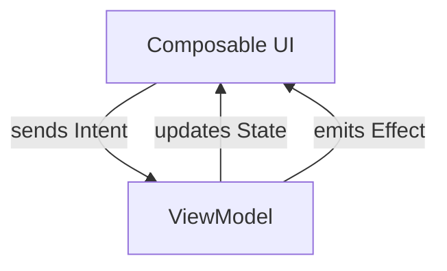

# Android Quick Start Template

A starter project for Android development with multiple architectures and dependency injection options. Includes pre-configured testing setup, modern libraries, and Jetpack Compose support.

⚠️ **IMPORTANT:** This repository is structured using branches. **Do not use the `main` branch directly for your project.** Please checkout the specific branch that matches your desired architecture and dependency injection framework.

---

## 🚀 Available Branches & Flavors

| Branch Name | Architecture | Dependency Injection |
|:--- |:--- |:--- |
| `feature/hilt-mvvm` | MVVM | Hilt |
| `feature/hilt-mvi`  | MVI  | Hilt |
| `feature/koin-mvvm` | MVVM | Koin |
| `feature/koin-mvi`  | MVI  | Koin |

---

## 🏗 Architecture Patterns

### MVI (Model-View-Intent)
Available in `feature/hilt-mvi` and `feature/koin-mvi`.



- **Intent**: User actions or system events (e.g., `Refresh`, `LoadData`).
- **State**: Single source of truth for the UI (e.g., `Loading`, `Success`, `Error`).
- **Effect**: One-time side effects like Navigation or Toasts.

### MVVM (Model-View-ViewModel)
Available in `feature/hilt-mvvm` and `feature/koin-mvvm`.
- Standard pattern using `StateFlow` or `LiveData` to expose state.
- Simpler flow for smaller features.

---

## 🛠 Dependency Injection Options

### Hilt
- Standard Android DI recommended by Google.
- Compile-time safety and deep integration with Jetpack libraries.
- Use `feature/hilt-*` branches.

### Koin
- Pragmatic and lightweight Kotlin-first DI.
- No code generation (KSP/KAPT), faster build times.
- Use `feature/koin-*` branches.

---

## 📦 Project Structure

```text
├── features/        # Feature modules (Home, Detail, etc.)
│   └── home/        # Example feature implementation
├── core/            # App-wide configurations, Network, DB, and DI setup
├── utils/           # Shared utility classes (e.g., DeviceInfo, Dispatchers)
├── test/            # Unit and instrumentation tests
└── build.gradle     # Build configuration and dependencies
```

---

## 🧪 Testing Setup

Pre-configured for both Unit and UI testing:
- **Hilt/Koin Testing**: Custom runners and mock modules ready to use.
- **Compose Testing**: `createComposeRule` and `testTags` for reliable UI tests.
- **Coroutines**: `Turbine` for Flow testing and `kotlinx-coroutines-test`.

---

## 🚀 How to Use

1. **Clone the repository**:
   ```bash
   git clone https://github.com/yourusername/android-quick-start.git
   ```
2. **Checkout your specific branch**:
   ```bash
   # Example for Hilt + MVI
   git checkout feature/hilt-mvi
   ```
3. **Sync and Run** the project in Android Studio.

---

## Contributing
Contributions are welcome! Please submit a PR if you'd like to improve the templates or add new architecture flavors.

## License
MIT License © 2026 Syed Ovais Akhtar
